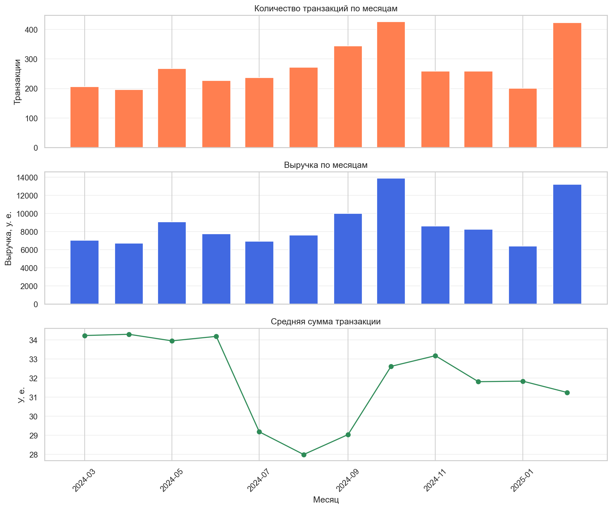
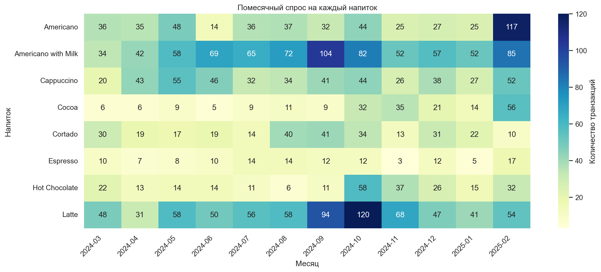
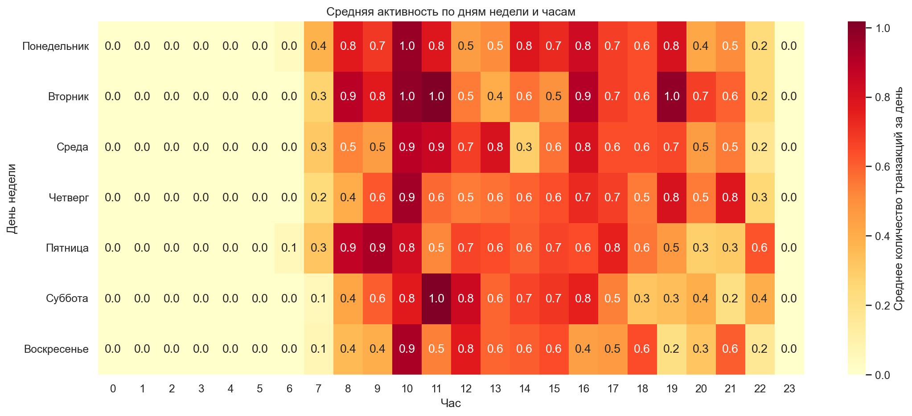

# Разведочный анализ продаж кофейного автомата

EDA 3 636 зарегистрированных операций кофейного автомата за период с 1 марта 2024 года по 23 марта 2025 года.

**[Открыть ноутбук](notebooks/coffee_sales_eda.ipynb)**

## Цель проекта

Оценить качество данных, исследовать динамику транзакций и выручки, структуру спроса на ассортимент, временные закономерности, способы оплаты и повторяемость операций по анонимизированным идентификаторам карт.

## Основные результаты

- среди полных месяцев максимум зафиксирован в октябре 2024 года: 426 операций и 13 891,16 у. е. выручки;
- Americano with Milk лидирует по количеству операций — 824, а Latte по выручке — 27 866,30 у. е.;
- максимальная средняя сумма операции составила 34,29 у. е. в апреле 2024 года, минимальная — 27,99 у. е. в августе;
- спрос на разные напитки достигал максимума в разные месяцы: например, Latte — в октябре 2024 года, Americano — в феврале 2025 года;
- пиковый час — 10:00–10:59; средняя дневная активность максимальна во вторник и минимальна в воскресенье;
- после 3 июня 2024 года наличные операции в данных отсутствуют;
- 41,4% идентификаторов карт встречаются повторно, и на них приходится 78,3% карточных операций.

## Данные

Источник: [Coffee Sales на Kaggle](https://www.kaggle.com/datasets/ihelon/coffee-sales).

Одна строка соответствует зарегистрированной операции. Датасет содержит дату и время, способ оплаты, анонимизированный идентификатор карты, сумму операции и название напитка.

В репозитории хранится локальный снимок `data/index_1.csv`, использованный для расчётов. Датасет на Kaggle обновляется, поэтому актуальная версия источника может отличаться от зафиксированной в проекте.

## Инструменты

- Python 3.13;
- pandas;
- Matplotlib;
- seaborn;
- Jupyter Notebook.

## Структура репозитория

~~~text
.
├── data/
│   ├── README.md
│   └── index_1.csv
├── images/
│   ├── coffee_demand_heatmap.png
│   ├── monthly_dynamics.png
│   └── weekday_hour_heatmap.png
├── notebooks/
│   └── coffee_sales_eda.ipynb
├── .gitignore
├── README.md
└── requirements.txt
~~~

## Запуск

1. Клонируйте репозиторий и перейдите в его каталог.
2. Создайте и активируйте виртуальное окружение.
3. Установите зависимости:

   ~~~bash
   python -m pip install -r requirements.txt
   ~~~

4. Откройте `notebooks/coffee_sales_eda.ipynb` в Jupyter-совместимой среде и выполните все ячейки по порядку.

## Ограничения

- идентификатор карты не равен идентификатору человека;
- отсутствующие календарные даты могут означать как отсутствие операций, так и неполноту выгрузки;
- поле money отражает сумму операции, но датасет не раскрывает причины её изменения;
- нет данных о себестоимости, прибыли, остатках, доступности автомата и внешних факторах;
- обнаруженные временные совпадения не доказывают причинно-следственные связи.
